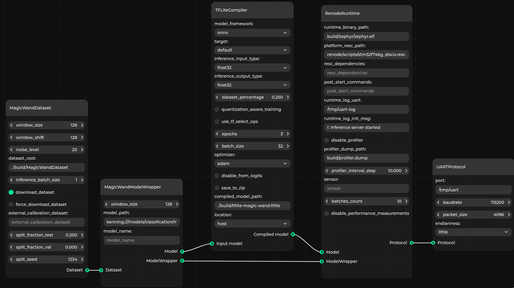
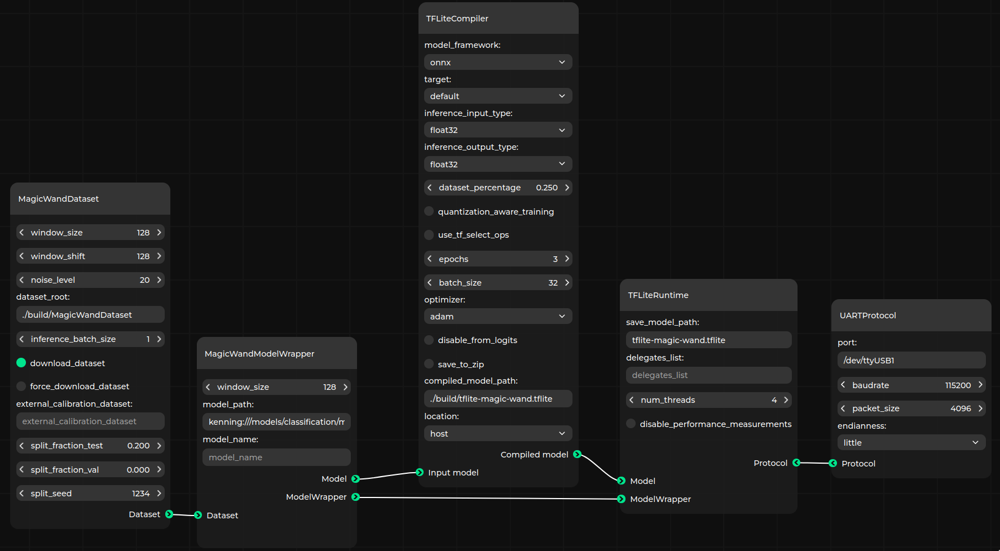

# Zephyr runtime for Kenning

Copyright (c) 2023-2024 [Antmicro](https://www.antmicro.com)

This project provides a Zephyr library for the [Kenning](https://github.com/antmicro/kenning) runtime API, along with an application for model evaluation.
Its aim is to simplify adoption and switching between existing runtime implementations.

## Overview

This repository provides:

* `kenning_inference_lib` - a Zephyr library providing generic wrapper methods for loading models and running inference, regardless of their underlying implementation.
* `kenning-zephyr-runtime` app - a Zephyr application used by [Kenning](https://github.com/antmicro/kenning) for evaluating models and runtimes on devices.
* demo application (`demo_app`) - a Zephyr application that uses `kenning_inference_lib` to run gesture recognition on sample data.

## Building the project

This section contains instructions for preparing Zephyr and building the runtime.

### System prerequisites

To be able to build and use the project, you need the folowing dependencies:

* [Zephyr dependencies](https://docs.zephyrproject.org/latest/develop/getting_started/index.html#install-dependencies)
* `jq`
* `curl`
* `west`
* `CMake`

On Debian-based Linux distributions, install the dependencies as follows:

```bash
sudo apt update

sudo apt install -y --no-install-recommends ccache curl device-tree-compiler dfu-util file \
  g++-multilib gcc gcc-multilib git jq libmagic1 libsdl2-dev make ninja-build \
  python3-dev python3-pip python3-setuptools python3-tk python3-wheel python3-venv \
  mono-complete wget xxd xz-utils
```

### Cloning the project and preparing the environment

First off, create a workspace directory and clone the repository:

```bash skip
mkdir zephyr-workspace && cd zephyr-workspace
git clone https://github.com/antmicro/kenning-zephyr-runtime.git
cd kenning-zephyr-runtime
```

After entering the project's directory, initialize a Zephyr workspace with:

```bash
./scripts/prepare_zephyr_env.sh
source .venv/bin/activate
```

This will:

* Download (if necessary) and set up the Zephyr SDK
* Download necessary toolchains
* Set up a Python virtual environment with necessary dependencies.

This can be reused to load the necessary environment before launching commands mentioned later in this README.

Now, prepare additional modules:

```bash
./scripts/prepare_modules.sh
```

### Building the Kenning runtime tester application

To build the Kenning Zephyr runtime, select a supported machine learning runtime and a board.

```bash skip
west build --board <board> app -- -DEXTRA_CONF_FILE=<runtime>.conf
```

You can provide one of the following runtimes in `<runtime>`:

* [tvm](https://tvm.apache.org/docs/topic/microtvm/index.html)
* [tflite](https://github.com/tensorflow/tflite-micro)

The project was tested on the following boards:

* [stm32f746g_disco](https://renodepedia.renode.io/boards/stm32f746g_disco/)
* [nrf52840dongle_nrf52840](https://renodepedia.renode.io/boards/nrf52840dongle_nrf52840)
* [nrf52840dk_nrf52840](https://renodepedia.renode.io/boards/nrf52840dk_nrf52840)
* [hifive_unleashed](https://renodepedia.renode.io/boards/hifive_unleashed)

Check the [Adding support for more boards section](#adding-support-for-more-boards) for information on whow to add a new target device.

The binary built after executing `west build` can be found in `build/zephyr/zephyr.elf`.

### Installing Kenning with Renode

Use `pip` to install [Kenning](https://github.com/antmicro/kenning) with Renode support enabled:

```bash
pip install --upgrade pip
pip install "kenning[tvm,tensorflow,reports,renode] @ git+https://github.com/antmicro/kenning.git"
```

The [pyrenode3](https://github.com/antmicro/pyrenode3/) module requires installing Renode to work.
The easiest way is to use the latest Renode package and store its location in `PYRENODE_PKG`:

```bash
wget https://builds.renode.io/renode-latest.pkg.tar.xz
export PYRENODE_PKG=`pwd`/renode-latest.pkg.tar.xz
```

For other configuration options check [pyrenode3 README.md](https://github.com/antmicro/pyrenode3/blob/main/README.md).

## Evaluating the model in Kenning

[Kenning](https://github.com/antmicro/kenning) provides:

* Model optimization and compilation
* Evaluation of a model on target device:
    * Sending the model to the device using UART communication (e.g. execution graph or TFLite Flatbuffer)
    * Sending input data for running inference on the model
    * Collecting output data from the model, and evaluating the quality and performance of the model on target device with selected runtime
* Report rendering, including comparison reports that allow to compare various runtimes, boards, models and applied optimizations.

With Kenning, we can also evaluate the runtime by simulating the device in Renode.
This allows us to:

* Verify model behavior without the need for physical hardware
* Check model and runtime performance and correctness in Continuous Integration pipelines without the actual device in the loop
* Check model and runtime performance on platforms under development
* Obtain more detailed metrics regarding device usage, e.g. histogram of instructions

The switch between Renode and actual hardware is seamless - both communicate with Kenning using UART.

### Building the project and evaluating models in Renode



This section will demonstrate how to build the project and evaluate a model for recognizing gestures on `stm32f746g_disco`.

#### Using TFLite Micro runtime

First off, build the `kenning-zephyr-runtime` app for `stm32f746g_disco` and the TFLite Micro configuration:

```bash
west build -p always -b stm32f746g_disco app -- -DEXTRA_CONF_FILE=tflite.conf
```

Then, evaluate the model in Renode using a sample scenario located in `kenning-scenarios/renode-zephyr-tflite-magic-wand-inference.json` and generate a report with performance and quality metrics:

```bash
kenning optimize test report \
    --json-cfg kenning-scenarios/renode-zephyr-tflite-magic-wand-inference.json \
    --measurements results.json --verbosity INFO \
    --report-path reports/stm32-renode-tflite-magic-wand/report.md \
    --to-html \
    --verbosity INFO
```

The model performance report in Markdown will be available under `reports/stm32-renode-tflite-magic-wand/report.md`.
The HTML version of the report will be accessible from `reports/stm32-renode-tflite-magic-wand/report/report.html`.

#### Using microTVM

To build the `kenning-zephyr-runtime` app to work with microTVM runtime, set `-DEXTRA_CONF_FILE` to `tvm.conf`, e.g. by executing:

```bash
west build -p always -b stm32f746g_disco app -- -DEXTRA_CONF_FILE=tvm.conf
```

Evaluate the model using the sample scenario located in `kenning-scenarios/renode-zephyr-tvm-magic-wand-inference.json`:

```bash
kenning optimize test report \
    --json-cfg kenning-scenarios/renode-zephyr-tvm-magic-wand-inference.json \
    --measurements results.json --verbosity INFO \
    --report-path reports/stm32-renode-tvm-magic-wand/report.md \
    --to-html \
    --verbosity INFO
```

## Evaluating a model in Kenning using actual hardware

Kenning can evaluate the runtime running on a physical device.
To do so, we need to flash the device and replace `RenodeRuntime` in evaluation scenarios for Kenning with proper runtimes.

### Running evaluation on NRF52840 dongle



Build the runtime for `nrf52840dongle_nrf52840` (let's use TFLite Micro in this example):

```bash skip
west build -p always -b nrf52840dongle_nrf52840 app -- -DEXTRA_CONF_FILE=tflite.conf
```

Flash Kenning runtime on the device by following [instructions](https://docs.zephyrproject.org/latest/boards/arm/nrf52840dongle_nrf52840/doc/index.html#option-1-using-the-built-in-bootloader-only) in the Zephyr documenation.

Finally, evaluate the model and generate a report with performance and quality metrics:

```bash skip
kenning optimize test report \
    --json-cfg kenning-scenarios/zephyr-tflite-magic-wand-inference.json \
    --measurements results.json --verbosity INFO \
    --report-types performance classification \
    --report-path reports/nrf-tflite-magic-wand/report.md \
    --to-html \
    --verbosity INFO
```

### Running evaluation on STM32F746

Build the runtime for `stm32f746g_disco` (let's use TFLite Micro in this example):

```bash skip
west build -p always -b stm32f746g_disco app -- -DEXTRA_CONF_FILE=tvm.conf
```

Flash the connected device with the `kenning-zephyr-runtime` app:

```bash skip
west flash
```

Evaluate the model and generate a report with performance and quality metrics:

```bash skip
kenning optimize test report \
    --json-cfg kenning-scenarios/zephyr-tvm-magic-wand-inference.json \
    --measurements results.json --verbosity INFO \
    --report-types performance classification \
    --report-path reports/stm32-tvm-magic-wand/report.md \
    --to-html \
    --verbosity INFO
```

## Demo application using Kenning inference library

The Kenning inference library present in this repository can be also used in actual applications, not only in the evaluation process in Kenning.

The application present in `demo_app` demonstrates how to use Kenning Zephyr Runtime in actual, simple use case, where we take a model recognizing gestures (`wing`, `ring`, `slope` and `negative`, trained with Magic Wand dataset) and compile it with picked runtime.
It goes through delivered inputs, runs inference and prints the output.

With the build environment configured as described in the [Cloning the project and preparing the environment](#cloning-the-project-and-preparing-the-environment), you can build the `demo_app` as follows:

* using the microTVM runtime:
  ```bash
  west build -p always -b hifive_unleashed demo_app -- -DEXTRA_CONF_FILE=tvm.conf
  ```
* using the TFLite Micro runtime:
  ```bash
  west build -p always -b hifive_unleashed demo_app -- -DEXTRA_CONF_FILE=tflite.conf
  ```

After building the application with a board specified, we can either flash the hardware with it, or simulate it in Renode.
To simulate it in Renode, generate the board's `repl` platform file using:

```bash
west build -t board-repl
```

The result can be found under `./build/<board_name>.repl`.

Finally, run the demo with:

```bash skip
python ./scripts/run_renode.py
```

The output should look like this:

```skip
Starting Renode simulation. Press CTRL+C to exit.
*** Booting Zephyr OS build zephyr-v3.5.0-5385-g415cb65e3f48 ***
__nop function is not yet supported.I: model output: [wing: 1.000000, ring: 0.000000, slope: 0.000000, negative: 0.000000]
I: model output: [wing: 0.000000, ring: 0.000000, slope: 0.000000, negative: 1.000000]
I: model output: [wing: 0.000000, ring: 0.000000, slope: 1.000000, negative: 0.000000]
I: model output: [wing: 1.000000, ring: 0.000000, slope: 0.000000, negative: 0.000000]
I: model output: [wing: 0.000000, ring: 0.997457, slope: 0.000000, negative: 0.002543]
I: model output: [wing: 0.000000, ring: 0.000000, slope: 1.000000, negative: 0.000000]
I: model output: [wing: 1.000000, ring: 0.000000, slope: 0.000000, negative: 0.000000]
I: model output: [wing: 1.000000, ring: 0.000000, slope: 0.000000, negative: 0.000000]
I: model output: [wing: 1.000000, ring: 0.000000, slope: 0.000000, negative: 0.000000]
I: model output: [wing: 0.000000, ring: 0.000000, slope: 1.000000, negative: 0.000000]
I: model output: [wing: 0.000000, ring: 0.000000, slope: 0.000000, negative: 1.000000]
I: inference done
```

## Adding support for more boards

Adapting `kenning-zephyr-runtime` for new boards is straightforward.
As long as the underlying runtime implementation supports a given board without additional configuration, the process of adapting the application for new board boils down to picking an UART for communication with the Kenning application running on host.
Such UART is expected to be aliased `kcomms` in the application.

The alias can be set in the overlay file under `app/boards/<board_name>.overlay`, where `<board_name>` is the name of the board in Zephyr, passed in `--board` flag in `west build`:

```dts
/ {
    aliases {
        kcomms = &uart0;
    };
};
```

It is crucial that the selected UART isn't used anywhere else (e.g. as `zephyr,console`).

Some boards may also require additional configuration.
Those should be placed at `app/boards/<board_name>.conf`.
