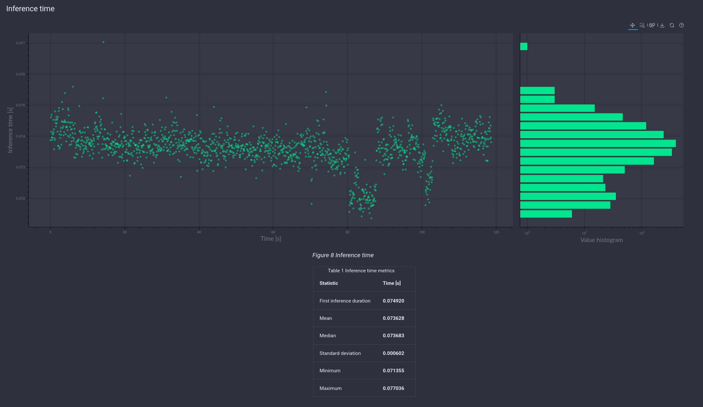
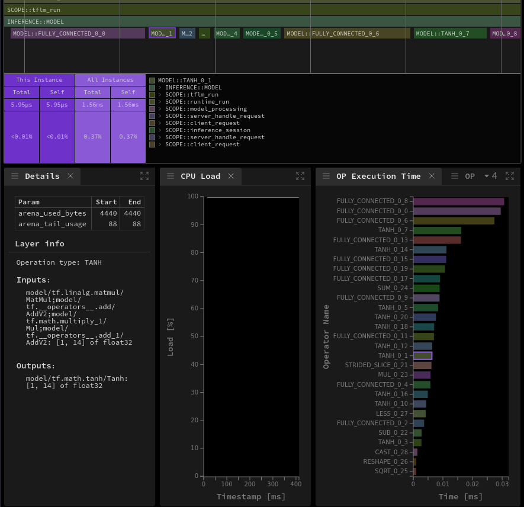
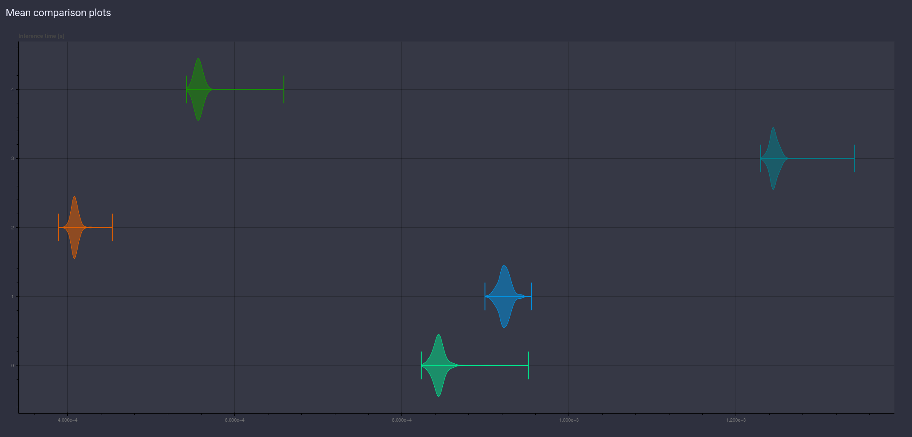

# Kenning Zephyr Runtime

Copyright (c) 2023-2026 [Antmicro](https://www.antmicro.com)

This is a set of tools for running and evaluating ML models on various inference frameworks (runtimes), such as [IREE](https://iree.dev/) or [microTVM](https://tvm.apache.org/), on boards that support Zephyr RTOS.
It provides a unified runtime-agnostic API, wrapping the runtimes and allowing to easily switch between them without rewriting any code.

This project is an integral part of the [Kenning](https://github.com/antmicro/kenning) ecosystem - it can be used in tandem with Kenning for model optimization, deployment and benchmarking (see [Model evaluation with Kenning](https://github.com/antmicro/kenning-zephyr-runtime/tree/main#using-microtvm)).
For detailed documentation, see the [Kenning Zephyr Runtime chapter of the general Kenning docs](https://antmicro.github.io/kenning/kenning-zephyr-runtime.html).

[Website](https://antmicro.com/kenning/) | [Kenning Documentation](https://antmicro.github.io/kenning/) | [Zephyr Runtime chapter of the Documentation](https://antmicro.github.io/kenning/kenning-zephyr-runtime.html) | [Kenning tutorials](https://antmicro.github.io/kenning/kenning-gallery.html)

## Overview

This repository provides:

* `kenning_inference_lib` - a Zephyr library providing a unified `model` API, allowing for executing ML models with the following runtimes:
  * [TFLite Micro](https://github.com/tensorflow/tflite-micro)
  * [microTVM](https://tvm.apache.org/)
  * [IREE](https://iree.dev/)
  * [emlearn](https://github.com/emlearn/emlearn)
  * [ExecuTorch](https://docs.pytorch.org/executorch/stable/index.html)
  * [AI8X](https://github.com/analogdevicesinc/ai8x-synthesis) for Analog Devices MAX78xxx platforms
* `app` - a Zephyr application used with [Kenning](https://github.com/antmicro/kenning) for evaluating models and runtimes on devices. For more information on available evaluation features, see the [Model evaluation with Kenning section of this document](https://github.com/antmicro/kenning-zephyr-runtime/tree/main#using-microtvm).
* demo application (`demo_app`) - a Zephyr application that uses `kenning_inference_lib` to run gesture recognition on sample data. It is meant to showcase the usage of `kenning_inference_lib` as a standalone production solution, without communication with Kenning.

## Quickstart (`demo_app`)

This is the minimal list of steps to build and run the `demo_app`.

### Preparing the environment

To be able to build and use the project, you need the following dependencies:

* [Zephyr dependencies](https://docs.zephyrproject.org/latest/develop/getting_started/index.html#install-dependencies)
* `jq`
* `curl`
* `west`
* `patch`
* `CMake`

The easiest way to obtain an environment with all dependencies is to [use the prepared Docker image](#using-the-docker-environment):

```
mkdir zephyr-workspace && cd zephyr-workspace
docker run --rm -it -v $(pwd):$(pwd) -w $(pwd) ghcr.io/antmicro/kenning-zephyr-runtime:latest /bin/bash
```

Alternatively, on Debian-based Linux distributions, you may instead install the dependencies as follows:

```bash
sudo apt update

sudo apt install -y --no-install-recommends ccache curl device-tree-compiler dfu-util file \
  g++-multilib gcc gcc-multilib git jq libmagic1 libsdl2-dev make ninja-build \
  python3-dev python3-pip python3-setuptools python3-tk python3-wheel python3-venv \
  mono-complete wget xxd xz-utils patch cmake npm
```

Now clone this repository:

```
git clone https://github.com/antmicro/kenning-zephyr-runtime
cd kenning-zephyr-runtime/
```

It is recommended to use the [`uv`](https://docs.astral.sh/uv/) package manager instead of `pip`, whenever using Kenning.
You can install `uv` on Linux or macOS with:

```bash
curl -LsSf https://astral.sh/uv/install.sh | sh
```

To make `uv` available in PATH, restart the shell or run:

```bash
source $HOME/.local/bin/env
```

And install Python dependencies, additional Zephyr modules, and Zephyr SDK:

```bash
./scripts/prepare_zephyr_env.sh
source .venv/bin/activate
./scripts/prepare_modules.sh
```

If you're going to be using Renode for simulations, install Renode with:

```bash
source ./scripts/prepare_renode.sh
```

**NOTE** The `prepare_renode.sh` script creates environmental variables, that allow Kenning to find Renode. It has to be ran every time a new shell is used.

### Building and running

At this point you should be able to build the demo app.
In this example, we're building the app for the `stm32f746g_disco` board.

```bash
west build -p always -b stm32f746g_disco demo_app -- -DEXTRA_CONF_FILE=tflite.conf
```

Then run the Renode simulation (before that we also need to generate a [REPL configuration file for Renode](https://renode.readthedocs.io/en/latest/host-integration/arduino.html#configuring-renode))

```bash
west build -t board-repl
python ./scripts/run_renode.py
```

Alternatively, you may run the demo on a physical board, using the `west flash` command.

The output should look like this:

```skip
*** Booting Zephyr OS build v4.3.0 ***
I: model output: [wing: 1.000000, ring: 0.000000, slope: 0.000000, negative: 0.000000]
I: model output: [wing: 0.000000, ring: 0.000000, slope: 0.000000, negative: 1.000000]
I: model output: [wing: 0.000000, ring: 0.000000, slope: 1.000000, negative: 0.000000]
I: model output: [wing: 1.000000, ring: 0.000000, slope: 0.000000, negative: 0.000000]
I: model output: [wing: 0.000000, ring: 0.997465, slope: 0.000000, negative: 0.002535]
I: model output: [wing: 0.000000, ring: 0.000000, slope: 1.000000, negative: 0.000000]
I: model output: [wing: 1.000000, ring: 0.000000, slope: 0.000000, negative: 0.000000]
I: model output: [wing: 1.000000, ring: 0.000000, slope: 0.000000, negative: 0.000000]
I: model output: [wing: 1.000000, ring: 0.000000, slope: 0.000000, negative: 0.000000]
I: model output: [wing: 0.000000, ring: 0.000000, slope: 1.000000, negative: 0.000000]
I: inference session statistics:
I:      total inference time: 1478 ms
I:      inference time per batch: 147 ms
I:      peak_allocated: 16288
I: inference finished successfully
```

## Model evaluation with Kenning

[Kenning](https://github.com/antmicro/kenning), along with its ecosystem of useful tools and applications, is meant to support ML engineers in every step of the model development and deployment process.

It includes a model benchmarking functionality, that makes it easy to asses performance of models across various ML inference frameworks, and generate comprehensive reports from those evaluations.

A fragment of such report can be seen below:



Kenning, however, is primarily a Linux CLI application.

Kenning Zephyr Runtime brings the evaluation functionality to devices running Zephyr RTOS.

### Kenning remote inference flow for Zephyr devices

The user runs Kenning commands on a PC, which communicates over UART with Kenning Zephyr Runtime running on an edge device (such as the `stm32f746g_disco` board).

Kenning compiles the model locally, using the [Optimizer](https://antmicro.github.io/kenning/kenning-api.html#optimizer-api) appropriate for the chosen ML framework (runtime) - like [TVMCompiler](https://github.com/antmicro/kenning/blob/main/kenning/optimizers/tvm.py) for the [microTVM](https://tvm.apache.org/) runtime.

Model weights, test data, and other information is then sent to the `inference_server` (which contains partial support for the [Kenning Protocol](https://antmicro.github.io/kenning/kenning-protocols.html#kenning-protocol), working over UART, in order to facilitate that), running as part of the `app`.

Model output is sent back, along with inference measurements (such as time and memory usage - the exact details depend on the runtime).
If the evaluation is being run in a Renode simulation - additional statistics are extracted from Renode.

All of that data is then used by Kenning to generate a report.

Kenning reports from Kenning Zephyr Runtime evaluations include details such as inference time, memory usage, and instruction counters - but also quality metrics, that can be used to assess whether the model's quality has degraded due to possible quantization or numerical instability.

### Dynamic runtime switching with LLEXT

Dynamic switching of the ML framework being used is supported through [LLEXT](https://docs.zephyrproject.org/latest/services/llext/index.html).

Entire runtimes can be compiled as LLEXT extensions, sent over the Kenning Protocol, and linked dynamically into the `kenning_inference_lib`.

This way the user can change the runtime, that is currently in use, without restarting the board or re-compiling the entire `app`.

Detailed information about this feature is available in a [dedicated section of the Kenning documentation](https://antmicro.github.io/kenning/kenning-zephyr-runtime.html#using-linkable-loadable-extensions-for-switching-entire-ai-runtimes-in-running-app).

### Detailed (per layer) model performance analysis through tracing

Thanks to the integration of [Zephelin tracing tool](https://antmicro.github.io/zephelin/) into Kenning, it is also possible to look inside your model - examine its performance layer-by-layer, and fine-tune it to your device of choice.

A sample interactive tracing report is available [here](https://antmicro.github.io/kenning/sample-zephyr-tracing-report.html).
A fragment of the report can be seen below:



### Working with AutoML and other Kenning features

All of the aforementioned evaluation capabilities are fully integrated with other Kenning functionalities, such as the [automated fine-tuning of model optimizers](https://antmicro.github.io/kenning/pipeline-optimizer.html#choosing-optimal-optimization-pipeline), or the [AutoML support](https://antmicro.github.io/kenning/gallery/anomaly-detection-automl.html).

In one of our examples, we use Kenning's AutoML functionality to generate and train several model architectures, while taking into account memory constraints of the intended deployment environment.
Then we automatically test and compare the performance of top five created models.

Fragment of the report from that example, showing inference time statistics, can be seen below, full interactive report is available [here](https://antmicro.github.io/kenning/sample-automl-report.html).



### Example - creating a model with AutoML and evaluating a model

In this example, we will use Kenning's AutoML support to create a VAE anomaly detection model.
Then we will optimize it for TFLite, evaluate it with Kenning Zephyr Runtime, and generate:

 * A full AutoML report, detailing the search process and comparing quality and performance of top 5 models generated during the process.
 * An evaluation report for the best model, including detailed Zephelin trace.

We will be using the [`kenning-scenarios/renode-auto-tflite-automl-vae-max32690.yml` configuration file](https://github.com/antmicro/kenning-zephyr-runtime/blob/main/kenning-scenarios/renode-auto-tflite-automl-vae-max32690.yml)

We define an `AutoPyTorchML` block as our AutoML engine, and set the search parameters:

```yaml
automl:
  # Implementation of the AutoML flow using AutoPyTorch
  type: AutoPyTorchML
  parameters:
    # Time limit for AutoML task (in minutes)
    time_limit: 5
    # List of model architectures used for AutoML,
    # represented by ModelWrapper (has to implement AutoMLModel class)
    use_models:
      - PyTorchAnomalyDetectionVAE
    output_directory: ./workspace/automl-results
    # Maximum number of models returned by the flow
    n_best_models: 5
    optimize_metric: f1
    # Type of budget for training models, either epochs or time limit
    budget_type: epochs
    # Lower and upper limit of the budget
    min_budget: 1
    max_budget: 5
    # Size of the application that will use generated models
    application_size: 85
```

Parameter `application_size` is the size, in kilobytes, of the application that is going to run the resulting model on the device.

For example; If you're building an intelligent sensor that reports detected anomalies over a network, then this is the size of the entire application (sensor drivers, network stack, data preprocessing) except of the model itself.

Then we define the target platform:

```yaml
# Chooses the platform to run
platform:
  type: ZephyrPlatform
  parameters:
    # Chooses MAX32690 Evaluation Kit
    name: max32690evkit/max32690/m4
    # Use Renode to simulate the platform
    simulated: True
```

Kenning has a set of platforms defined in [an extendable YAML file](https://github.com/antmicro/kenning/blob/main/kenning/resources/platforms/platforms.yml).

I will take the available memory of the platform, subtract the provided application size, and use the result as a maximum size constraint for the autogenerated model.

Setting `simulated: True` means, that the evaluation will be performed in a Renode simulation.

We also need to define a `runtime_builder` - a Kenning block, that will be automatically building the Kenning Zephyr Runtime evaluation `app` for each model that needs to be evaluated.

```yaml
runtime_builder:
  type: ZephyrRuntimeBuilder
  parameters:
    workspace: ./kenning-zephyr-runtime
    venv_dir: ../.venv
    output_path: ./workspace/kzr_build
    run_west_update: false
    extra_targets: [board-repl]
```

The `board-repl` extra target is only needed for simulations, since it generates a Renode configuration file for the selected board.

Finally, we need a `dataset` for training and the `TFLiteCompiler` for optimizing and deploying the best models:

```yaml
dataset:
  type: AnomalyDetectionDataset
  parameters:
    dataset_root: ./workspace/CATS
    csv_file: kenning:///datasets/anomaly_detection/cats_nano.csv
    split_fraction_test: 0.1
    split_seed: 12345
    inference_batch_size: 1

optimizers:
- type: TFLiteCompiler
  parameters:
    target: default
    compiled_model_path: ./workspace/automl-results/vae.tflite
    inference_input_type: float32
    inference_output_type: float32
```

The AutoML run will generate multiple models. The best one will be saved at `./workspace/automl-results/vae.0.tflite`.
Other ones will be saved under `vae.1.tflite`, `vae.2.tflite`, and so on.

Now we can run Kenning.
Since the `renode-auto-tflite-automl-vae-max32690.yml` config file has been written to be ran from outside the Kenning Zephyr Runtime root directory, we need to override `workspace` parameter of the `ZephyrRuntimeBuilder` block with a `--workspace .` flag:

```bash
kenning automl optimize test report \
   --cfg ./kenning-scenarios/renode-auto-tflite-automl-vae-max32690.yml \
   --report-path ./workspace/automl-report/report.md \
   --allow-failures --to-html \
   --verbosity INFO   --skip-general-information \
   --workspace .
```

Kenning will perform a search for optimal model architecture, with a 5 minute time limit, discard models that are too large for the chosen board, and then test performance of the models.

Models that crash during training, or fail to deploy, will be discarded without interrupting the run.

At the end generated models will be placed under `./workspace/automl-results`, and the HTML report page at `workspace/automl-report/report/report.html`.

Now we will run an evaluation of the best-quality model, and generate a more detailed report.

First we need to install Zephelin dependencies, for the report to render correctly:

```bash
uv pip install -r ../zephelin/requirements.txt
```

Then run:

```bash
kenning test report \
  --cfg ./kenning-scenarios/renode-auto-tflite-automl-vae-max32690.yml \
  --report-path ./report-vae/report.md --measurements results.json \
  --to-html --verbosity INFO --workspace . --skip-general-information \
  --compiled-model-path ./workspace/automl-results/vae.0.tflite \
  --modelwrapper-cls PyTorchAnomalyDetectionVAE --model-path _ \
  --enable-zephelin \
  --report-types \
      classification \
      performance \
      renode_stats \
      zephyr_traces
```

Kenning can infer needed report types from context, but doesn't include `renode_stats` by default - so we use `--report-types` to override it.

We also need to add a `ModelWrapper` with `--modelwrapper-cls` flag, since is not in the configuration file (it was not needed for the AutoML process).

HTML report is saved at `report-vae/report/report.html`.

The process can be easily reproduced for another problem, by writing a `Dataset` class for another dataset.
More detailed instructions are available in the [Kenning documentation](https://antmicro.github.io/kenning).

### Further reading - tutorials and examples

For more information on how to configure and run these workflows, see:

* [The relevant section of the documentation](https://antmicro.github.io/kenning/kenning-zephyr-runtime.html#model-evaluation-with-kenning-using-app), which is a comprehensive guide on using Kenning Zephyr Runtime for model evaluation.
* [Example of generating a comparison report](https://antmicro.github.io/kenning/gallery/kenning-zephyr-runtime.html), comparing two ML execution frameworks (microTVM and TFLite).
* [Example of using AutoML to create an anomaly detection model and test it on the MAX32690 Evaluation Kit](https://antmicro.github.io/kenning/gallery/anomaly-detection-automl.html).
* [Example of evaluating a model on a physical board](https://antmicro.github.io/kenning/gallery/anomaly-detection-on-mcu.html).


## Useful cmake functions provided by Kenning Zephyr Runtime

There are several CMake functions, defined in the `cmake` directory.
These functions are used by `demo_app` and can be used by any application using `kenning_inference_lib`.

### Automatically generating .repl files for Renode

CMake function `kenning_add_board_repl_target` will add a CMake target `board-repl`.
This target will use the [`dts2repl`](https://github.com/antmicro/dts2repl) tool, to generate a [.repl file](https://renode.readthedocs.io/en/latest/basic/describing_platforms.html#describing-platforms) (this file format is used by the [Renode emulator](https://renode.io/) to describe simulated devices).

This function is used in the [`demo_app` CMake file](https://github.com/antmicro/kenning-zephyr-runtime/blob/main/demo_app/CMakeLists.txt#L21C1-L21C32).

After adding the target to a Zephyr application, you will be able to build a `.repl` file for the board, for which the last build was ran:

```bash
west build -t board-repl
```

The `.repl` file will be saved to `build/<board name>.repl`.
For example `build/stm32f746g_disco.repl` for the `stm32f746g_disco` board.

### Increasing memory size for a simulated board

Function `kenning_increase_board_memory` will add a target `increase-memory`.

This target creates an `.overlay` file for the board, with increased memory size.
Thus Zephyr will allow a build requiring more memory, which can be then ran in a simulation (this will not work on hardware).

Adding it to a Zephyr application will allow to increase memory size of a simulated board, in a way that was described in [this section of the README](#increasing-simulated-board-memory-for-evaluation-of-larger-models).

This function is used in both the `demo_app` and [`app` CMake files](https://github.com/antmicro/kenning-zephyr-runtime/blob/main/app/CMakeLists.txt#L8).
